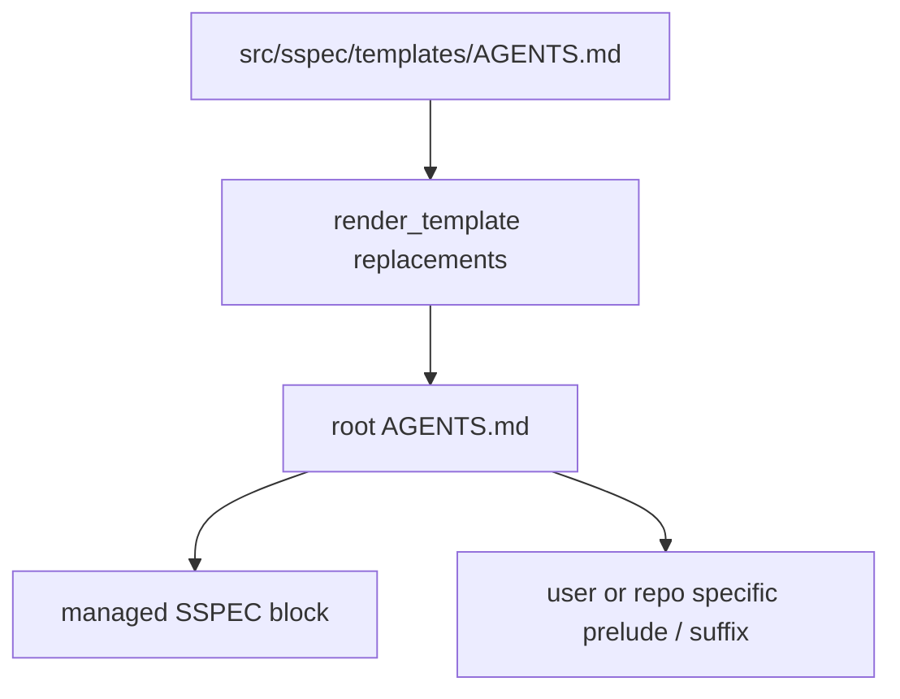

# Root AGENTS Sync

## Overview

`sspec` 会把协议块同步到项目根目录 `AGENTS.md`。
这一机制既服务普通用户项目，也服务 sspec 仓库自身的自举开发。

核心原则：**当根文件中已有 `SSPEC:START/END` 标记时，只管理标记包围的块；块外内容视为项目自有内容。**

## Ownership Model



约束：
- 模板来源是 `src/sspec/templates/AGENTS.md`
- 渲染时会替换如 `{{SCHEMA_VERSION}}` 之类的占位符
- 根文件中块外内容必须保留

## Update Cases

`update_root_agents_block()` 只定义文件级同步行为：

| 场景 | 结果 |
|------|------|
| 根 `AGENTS.md` 不存在 | 创建整个渲染后的文件 |
| 文件存在但无 `SSPEC:START/END` | 在原文件末尾追加整个渲染模板 |
| 文件存在且有标记 | 仅替换标记包围的块，保留前后内容 |
| 渲染结果与现状一致 | 返回 `False`，不改文件 |
| `dry_run=True` | 只报告是否会变化，不落盘 |

## Marker Contract

受管块使用以下边界：

```html
<!-- SSPEC:START -->
...
<!-- SSPEC:END -->
```

实现通过正则匹配整个区间，而不是逐行 diff。
因此模板内块结构变更时，视为整块替换。

## Project Lifecycle Integration

### `project init`

- 初始化 `.sspec/` 后调用 `update_root_agents_block()`
- 若根 `AGENTS.md` 被创建或更新，CLI 会提示用户

### `project update`

- 当模板协议块变化时，同样通过 `update_root_agents_block()` 刷新根文件
- 该行为与 `.sspec/` 内用户自管理文件更新逻辑分离

## Self-Hosting Note

在 sspec 仓库自身，根 `AGENTS.md` 还包含一段位于受管块之外的开发者前导说明。
这段说明不应由 `update_root_agents_block()` 覆盖；只有 `SSPEC:START/END` 内的协议块来自模板。

## Testing Requirements

- 文件不存在时创建
- 无标记时追加模板
- 有标记时只替换中间块并保留前后内容
- 内容无变化时返回 `False`
- `dry_run=True` 不写文件

## References

- [SKILL Installation & Sync](./skill-installation.md) — root `AGENTS.md` 与 skill sync 是 `project init/update` 的两个独立同步面
- [Testing Standards](./testing-standards.md) — `agents_service.py` 的测试义务
