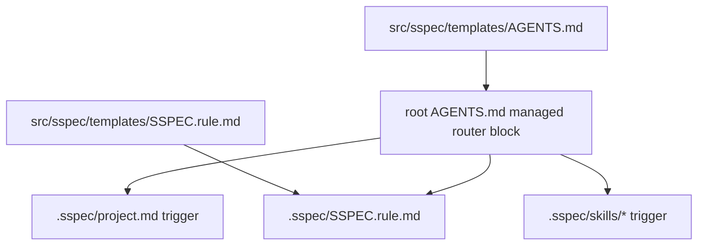

# Root AGENTS Router Sync

## Overview

`sspec` 同步两个 agent-facing 规则面：

| Surface | Installed path | Template source | Purpose |
|---|---|---|---|
| Root router | `AGENTS.md` managed `SSPEC:START/END` block | `src/sspec/templates/AGENTS.md` | Small always-loaded router: read project context, decide when to load sspec workflow |
| Full workflow rule | `.sspec/SSPEC.rule.md` | `src/sspec/templates/SSPEC.rule.md` | Managed full sspec lifecycle, CLI, align, scale, and peripheral rules |

核心原则：**root `AGENTS.md` 只管理 `SSPEC:START/END` 标记包围的 router block；块外内容视为项目自有内容。**

## Ownership Model



约束：
- `AGENTS.md` 模板是 router，不是完整 workflow manual。
- `.sspec/SSPEC.rule.md` 是受管文件，通过 `UPDATABLE_FILES` 参与 `project init/update`。
- `.sspec/project.md` 是用户文件，只在 init 创建，update 不覆盖。
- 渲染时替换 `{{SCHEMA_VERSION}}` 等占位符。

## Root AGENTS Update Cases

`update_root_agents_block()` 只定义 root `AGENTS.md` 文件级同步行为：

| 场景 | 结果 |
|------|------|
| 根 `AGENTS.md` 不存在 | 创建整个渲染后的 router 文件 |
| 文件存在但无 `SSPEC:START/END` | 在原文件末尾追加整个渲染 router 模板 |
| 文件存在且有标记 | 仅替换标记包围的块，保留前后内容 |
| 渲染结果与现状一致 | 返回 `False`，不改文件 |
| `dry_run=True` | 只报告是否会变化，不落盘 |

## Marker Contract

受管块使用以下边界：

```html
<!-- SSPEC:START -->
...
<!-- SSPEC:END -->
```

实现通过正则匹配整个区间，而不是逐行 diff。
因此 router 模板结构变更时，视为整块替换。

## Project Lifecycle Integration

### `project init`

- 初始化 `.sspec/` 后复制 `.sspec/SSPEC.rule.md`。
- 初始化 `.sspec/project.md`，但该文件归用户管理。
- 调用 `update_root_agents_block()` 创建/更新 root router。
- 若根 `AGENTS.md` 被创建或更新，CLI 会提示用户。

### `project update`

- 通过 `UPDATABLE_FILES` 检查 `.sspec/SSPEC.rule.md`：`missing/current/updatable/modified/unknown`。
- 默认不覆盖本地修改过的 `.sspec/SSPEC.rule.md`；`--force` 才覆盖。
- 通过 `update_root_agents_block()` 刷新 root router。
- 该行为与 skill sync、orphan skill cleanup 分离。

## Self-Hosting Note

在 sspec 仓库自身，根 `AGENTS.md` 还包含一段位于受管块之外的开发者前导说明。
这段说明不应由 `update_root_agents_block()` 覆盖；只有 `SSPEC:START/END` 内的 router block 来自模板。

## Testing Requirements

- root `AGENTS.md` 不存在时创建 router。
- root `AGENTS.md` 无标记时追加 router。
- root `AGENTS.md` 有标记时只替换中间块并保留前后内容。
- root router 包含 `.sspec/project.md` 与 `.sspec/SSPEC.rule.md` 触发器。
- root router 不包含 full lifecycle body。
- `.sspec/SSPEC.rule.md` 在 init 时创建并被 `.meta.json.file_hashes` 跟踪。
- `project update` 能创建缺失的 `.sspec/SSPEC.rule.md`，并保护本地修改。

## References

- [SKILL Installation & Sync](./skill-installation.md) — root router 与 skill sync 是 `project init/update` 的两个独立同步面
- [meta.json (Project Metadata)](./meta-json.md) — `.sspec/SSPEC.rule.md` hash tracking and `sspec_schema`
- [Testing Standards](./testing-standards.md) — `agents_service.py` / project update testing obligations
