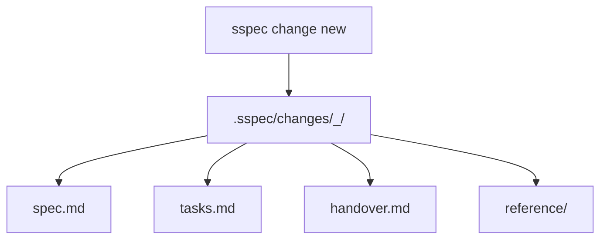
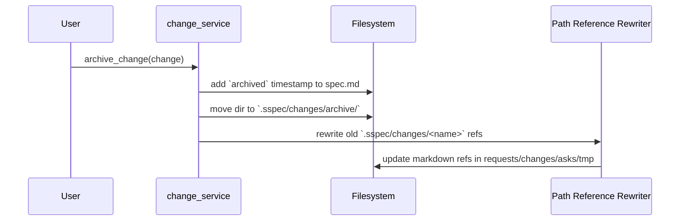

# Change Lifecycle

## Overview

`.sspec/changes/<timestamp>_<name>/` 是 sspec 中的核心工作单元。
一个 change 同时承载：设计、任务、handover、引用关系，以及可归档的会话边界。

本规范只描述 **当前磁盘契约和读取/归档语义**，不记录某次 change 的历史内容。

## On-Disk Layout



标准目录内容：

```text
.sspec/changes/<timestamp>_<name>/
├── spec.md
├── tasks.md
├── handover.md
└── reference/
```

约束：
- `spec.md`：设计与状态入口
- `tasks.md`：执行计划与进度
- `handover.md`：会话续接入口
- `reference/`：研究稿、设计草图、状态分析等辅助资料

## Creation Contract

`create_change()` 负责以下契约：

1. 规范化名称：小写、空格转 `-`、移除非 `[a-z0-9-]` 字符
2. 生成目录名：`<yy-MM-ddTHH-mm>_<name>`
3. 复制模板：
   - 单 change / sub-change 使用 `src/sspec/templates/change/`
   - root change 使用 `src/sspec/templates/change-root/`
4. 总是创建 `reference/` 目录

无效名称抛 `InvalidChangeNameError`；同分钟同名冲突抛 `ChangeExistsError`。

## Spec Frontmatter Contract

`spec.md` 的关键 frontmatter 由模板和读取逻辑共同约束：

```yaml
name: refresh-spec-docs
status: PLANNING
type: ""
change-type: single
created: 2026-03-06T23:39:00
reference:
  - source: ".sspec/requests/26-03-06T12-00_demo.md"
    type: "request"
    note: "Linked from request"
```

字段语义：
- `name`：逻辑名称；默认与目录名中的纯名称一致
- `status`：change 状态，读取时会经过别名归一化
- `type`：项目自定义分类字段，默认可为空
- `change-type`：`single` / `sub` / `root`
- `reference`：跨请求、跨 change、跨 doc 的持久引用

## Status Model

change 的 canonical 状态来自 `ChangeStatus`：

| 状态 | 含义 |
|------|------|
| `PLANNING` | 设计/计划阶段，尚未进入实施 |
| `DOING` | 实施中 |
| `BLOCKED` | 因缺信息、依赖或决策而阻塞 |
| `REVIEW` | 等待用户验收或反馈 |
| `DONE` | 当前工作轮次已完成 |
| `CLOSED` | 历史兼容值；通常用于别名/归档语义 |

读取时通过 `normalize_status()` 处理常见别名，例如 `IN_PROGRESS` -> `DOING`。

## Read Model

`parse_change()` 与 `summarize_change()` 共同定义本地状态面板的读取契约：

```text
change directory
  │
  ├── read spec.md        -> name / status / type / reference
  ├── read tasks.md       -> done/total checkbox progress
  ├── inspect spec body   -> PIVOT marker, BLOCKED status
  └── read handover.md    -> updated timestamp, latest session log, root snapshot
```

读取规则：
- `tasks.md` 进度只统计真实 checkbox，忽略模板注释与 `<Demo Task>`
- `has_pivot` 通过 `PIVOT` 文本检测
- `has_blockers` 由 `status == BLOCKED` 决定
- `summarize_change()` 会产出 `spec` / `tasks` / `handover` 链接，并尽量读取 `reference/status-research.md`

## Root Change vs Single Change

| 类型 | 模板 | 任务粒度 |
|------|------|----------|
| `single` | `templates/change/` | 文件级任务 |
| `sub` | `templates/change/` | 文件级任务，但必须引用 root change |
| `root` | `templates/change-root/` | 里程碑级任务，协调 sub-change |

root change 不负责文件级实现细节；它协调阶段、子 change、handover 快照。

## Archive Flow



归档契约：
- 目录移动到 `.sspec/changes/archive/`
- `spec.md` frontmatter 先写入 `archived` 时间戳
- 同名冲突自动追加 `_1`、`_2` 等后缀
- 所有旧路径引用会在 `requests/`、`changes/`、`asks/`、`tmp/` 中被精确替换

## Validation Contract

`validate_change()` 用于结构与内容健康检查，至少覆盖：
- 必需文件缺失
- `spec.md` 缺 `name` 或 `status`
- 模板占位 section 未被填充

它返回问题列表，不直接修改文件。

## Testing Requirements

- `create_change()`：目录结构、模板差异、名称规范化、冲突错误
- `parse_change()`：状态别名、进度统计、pivot/blocker 识别
- `archive_change()`：移动、`archived` 时间戳、引用改写
- `validate_change()`：缺文件、空 section、修复后告警消失

## References

- [Interaction Records](./interaction-records.md) — request / ask 与 change 的链接和归档关系
- [Testing Standards](./testing-standards.md) — change 相关测试义务
