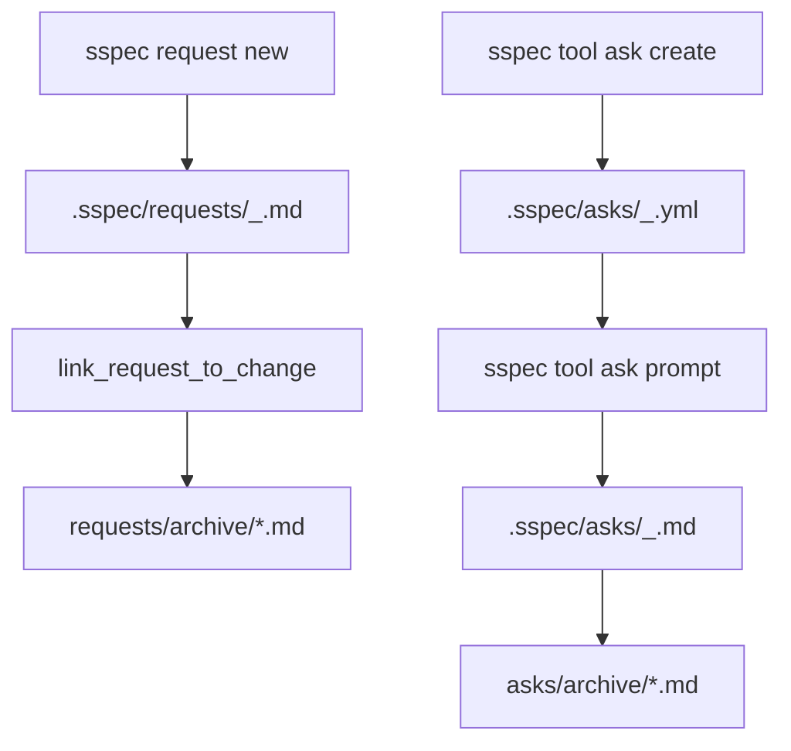

# Interaction Records

## Overview

sspec 通过两类持久记录承载人与 Agent 的互动：

- `request`：开发者意图记录（任务/现象/想法）
- `ask`：Agent 在缺少 `question`-like 工具时使用的 fallback 对齐记录

这两类记录都必须能被归档，并在归档后保持跨文件引用有效。

说明：当前推荐入口是 `sspec tool ask ...`；顶级 `sspec ask ...` 作为兼容入口保留，二者共享同一套实现与记录格式。

## Lifecycle Overview



## Request Contract

### Naming

- 当前格式：`<yy-MM-ddTHH-mm>_<name>.md`
- 兼容旧格式：`<yyMMddHHmmss>-<name>.md`
- 逻辑名称通过 `normalize_request_name()` 规范为 kebab-case

### Frontmatter

默认创建内容：

```yaml
created: 2026-03-07T00:00:00
status: OPEN
kind: directive
attach-change: null
tldr: ''
```

补充规则：
- `name` 可选；缺失时从文件名提取
- `kind` 控制模板结构，可选值为 `directive | observe | idea`，默认 `directive`
- `status` 读取时走 `normalize_status()`，兼容历史别名
- `tldr` 为空时，会从正文中提取首条有效摘要

### Request Kinds

`kind` frontmatter 字段控制创建时选择哪个模板。不同 kind 仅影响模板结构和注释规则，不改变运行行为。

| kind | 模板 | 定位 | @AGENT |
|------|------|------|--------|
| `directive` | `requests.md` | 人向 Agent 指派任务，期望立即行动 | 有 |
| `observe` | `observe.md` | 记录观察到的现象/问题，方便以后讨论/triage | 无 |
| `idea` | `idea.md` | 想法备忘，可能演化或捡起 | 无 |

CLI：

```bash
sspec request new <name>                    # 默认 directive
sspec request new <name> --kind observe     # 现象记录
sspec request new <name> --kind idea        # 想法备忘
```

### Linking to Change

`link_request_to_change()` 负责双向绑定：

```text
request file
  │
  ├── frontmatter `attach-change` -> `.sspec/changes/<dir>/spec.md`
  ├── frontmatter `status`        -> `DOING`
  └── target change `spec.md`
        └── append `reference` item {source, type: request, note}
```

要求：
- `attach-change` 保存的是 `spec.md` 的工作区相对路径
- change `reference` 不得重复追加同一 request
- change 不存在时抛 `FileNotFoundError`

### Archiving Requests

归档到 `.sspec/requests/archive/` 时：
- 原文件 frontmatter 先写入 `archived` 时间戳
- 同名冲突自动追加后缀
- 所有引用在 `requests/`、`changes/`、`asks/`、`tmp/` 中精确改写

## Ask Contract

### Command Entry Points

| Entry | Status | Purpose |
|------|--------|---------|
| `sspec tool ask ...` | preferred | fallback ask workflow for agents without a `question` tool |
| `sspec ask ...` | compatibility | legacy-compatible alias to the same implementation |

### Active File Types

| 后缀 | 用途 | 状态 |
|------|------|------|
| `.yml` | 当前首选 pending ask 模板 | active |
| `.py` | 旧版 pending ask 模板 | legacy-compatible |
| `.md` | 已完成 ask 记录 | active |

### Naming

- ask 名称通过 `normalize_ask_name()` 转成下划线风格标识符
- 当前创建格式：`<yyMMddHHmmss>_<name>.yml`
- 名称被规范化时，会返回 warning 给调用方

### Pending YAML Schema

```yaml
created: "2026-03-07T00:00:00"
reason: |-
  Ask user for <brief_reason>
question: |-
  <YOUR_QUESTION_HERE>
user_answer: |
  USER_FILL_HERE
```

字段语义：
- `reason`：为什么需要这次对齐
- `question`：要向用户展示的问题
- `user_answer`：用户预填答案；非空时可跳过终端交互

### Prompt / Save / Convert Flow

```text
pending ask (.yml or .py)
  │
  ├── execute_ask_prompt()
  │     ├── prefilled `user_answer` / `USER_ANSWER` -> direct return
  │     └── otherwise collect multiline input
  ├── save_ask_answer()
  └── convert_ask_to_md()
        ├── write `.md`
        └── delete pending source file
```

`.md` 记录格式：

```yaml
created: 2026-03-07T00:00:00
name: design_align
why: Ask user for design confirmation
```

正文固定包含两段：
- `# User Answer #`
- `# Agent Question History #`

### Legacy Python Compatibility

`.py` pending ask 仍被支持，但只作为兼容输入格式。

约束：
- prompt 读取 `REASON` / `QUESTION` / 可选 `USER_ANSWER`
- 转 `.md` 时要求 `CREATED` / `REASON` / `QUESTION` / `ANSWER`
- 新建 ask 不再生成 `.py`

### Archiving Asks

只归档完成后的 `.md` ask。

行为：
- 目标路径：`.sspec/asks/archive/`
- 同名冲突自动追加后缀
- 引用改写范围：`requests/`、`asks/`、`tmp/`、`changes/`

## Testing Requirements

- request：名称提取、frontmatter 解析（含 `kind`）、link、archive、引用改写
- ask：YAML 模板、预填答案、legacy `.py` 兼容、转 `.md`、archive
- 跨模块：request/change/ask archive 后引用路径保持可追踪

## References

- [Change Lifecycle](./change-lifecycle.md) — request 与 change 的双向引用关系
- [Testing Standards](./testing-standards.md) — interaction record 相关测试义务
