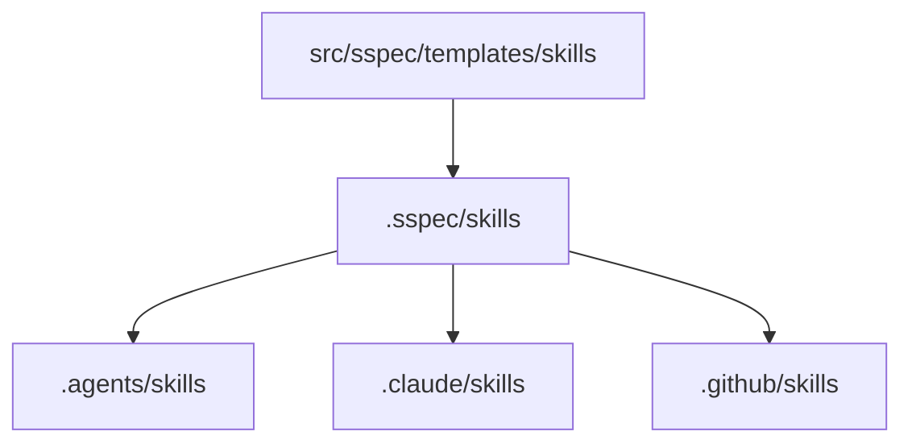

# SKILL Installation & Sync

## Overview

本规范定义 `sspec` 当前 SKILL 安装体系：以 `.sspec/skills` 为唯一 hub，外部位置（`.agents`、`.claude`、`.github` 或自定义相对目录）作为 spoke 同步。

目标：
- 保持 init/update 的行为一致和可回归；
- 在 Windows 上优先链接并兼顾无管理员权限场景；
- 支持从旧版逐 skill 链接布局平滑迁移。

## Current Architecture

- Hub：`.sspec/skills`（托管技能真源）
- Spoke：外部 agent 目录下的 `skills`（目录级 link 或 copy）
- 默认交互式候选位置：`.claude`、`.github`、`.agents`
- 自定义位置必须是相对项目根目录的安全路径；最终落点统一为 `<location>/skills`

## Init Flow

1. `project init` 先完成 `.sspec` 核心初始化并安装 hub skills。
2. 再询问外部同步位置。
3. 安装策略按平台固定：
   - Windows：`junction -> copy`
   - Linux/macOS：`symlink -> copy`
4. 若用户未选择任何外部目录，强制回退 `.agents`，并提示后续可迁移。

说明：当前 Windows 实现不再尝试“提权 symlink”；公开语义只有 `link` 与 `copy`，其中 `link` 在 Windows 上通常落为 junction。

## Update Flow

`project update` 执行顺序：
1. 同步 `.sspec/skills/.gitignore` 中的受管 skill 列表
2. legacy layout 迁移（旧版逐 skill 子链接）
3. orphan skill 清理
4. template + skill 更新候选计算
5. 根据状态和 force 策略执行

Skill 候选状态语义（copy 目录）：
- `current`: `current_hash == new_hash`
- `updatable`: `current_hash == old_hash`
- `modified`: 既不等于 `new_hash` 也不等于 `old_hash`
- `unknown`: 缺失 `old_hash` 且不等于 `new_hash`

## Link Detection Contract

`check_path_link(path, expected_target?)` 是 link 判定统一入口：
- 支持 symlink 与 junction
- 不允许业务逻辑直接依赖 `Path.is_symlink()` 判定完整语义

## Gitignore Contract

自动管理通过 fenced block 写入：
- `# >>> sspec-managed skills >>>`
- `# <<< sspec-managed skills <<<`

规则：
- hub 场景写入 `.sspec/skills/.gitignore`，精确列出当前受管理的 skill 名称；未受管理的自定义 skill 仍可被跟踪
- spoke 场景写入父目录（例如 `.github/.gitignore`）并维护 `skills` 条目
- 幂等更新，不重复追加

## Legacy Design (Previous Scheme)

旧方案特征：
- 外部位置采用“逐 skill 子目录链接”
- 更新逻辑按 per-skill copy 候选推断，语义分散
- 在 very-legacy 场景中可能出现首轮仅清理 orphan，次轮才迁移

已改进：
- 迁移条件改为“只要检测到任一指向 hub 的 legacy 子链接即迁移”
- 备份阶段不再重建 symlink（避免 WinError 1314）

## Migration & Rollback Notes

迁移会在 `.sspec/tmp/skills-backup/<timestamp>/` 写入备份。

若迁移后需要回滚：
1. 删除当前 spoke `skills` 路径
2. 从对应 backup 目录恢复
3. 再次运行 `sspec project update`（可配合 `--dry-run` 先检查）

## Decision Notes

- 目录级 spoke 优于逐 skill spoke：结构更稳定，识别更一致。
- Junction 是 Windows 下默认 link 方式；对外策略统一为 `link`。
- 修改保护优先：`modified` 状态默认不覆盖，需 `--force`。
- `.sspec/skills` 是 hub 真源；spoke 只是分发视图，不应手动编辑为主要维护入口。
