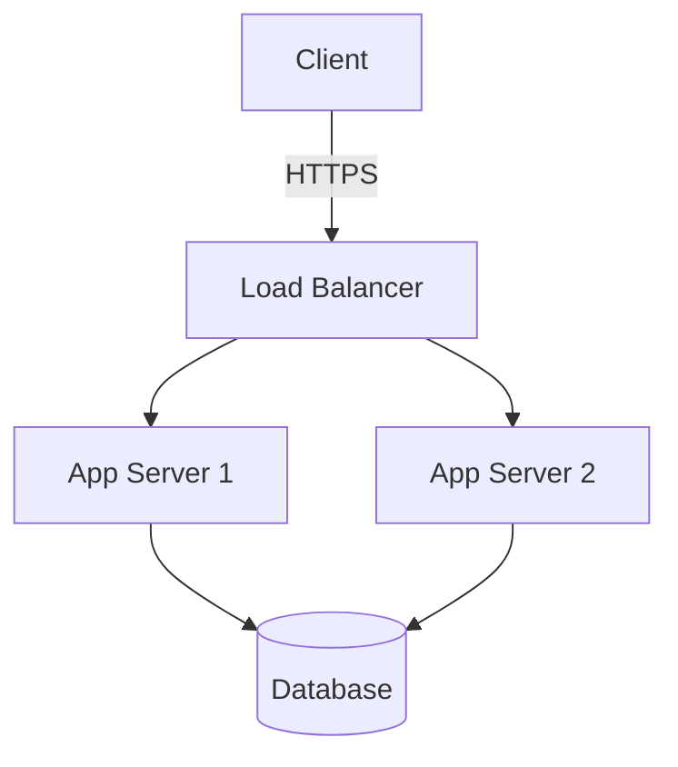
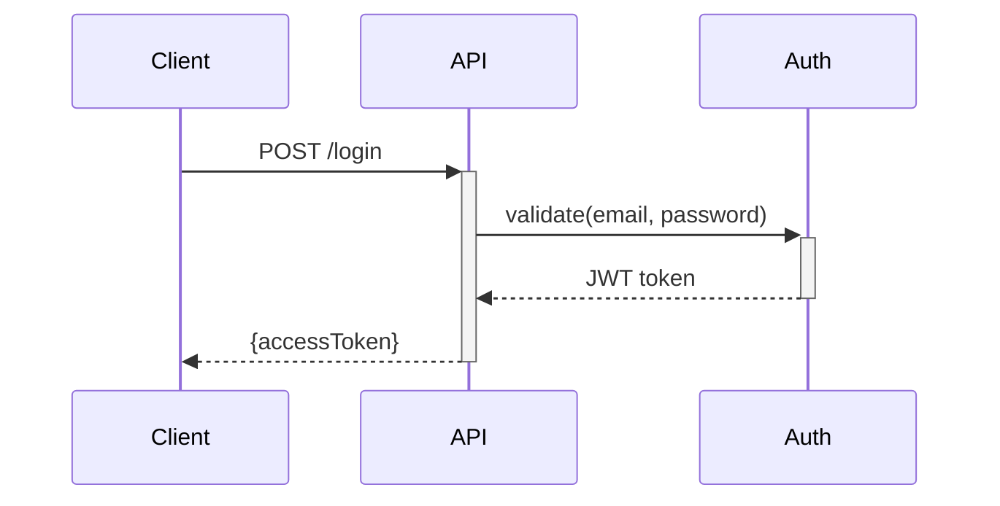

# Write-Spec-Doc

This skill covers:
- [When to Create](#when-to-create) - Decision criteria
- [Frontmatter](#frontmatter) - Required metadata fields
- [Body Structure](#body-structure) - Template and organization
- [Scope Definition](#scope-definition) - File path patterns
- [Style Guide](#style-guide) - What to include/exclude
- [Diagramming](#diagramming) - Mermaid examples
- [Relationship to Changes](#relationship-to-changes) - Keeping specs current
- [Deprecation](#deprecation) - Archiving obsolete specs
- [Multi-File Specs](#multi-file-specs) - Complex subsystems
- [Maintenance Checklist](#maintenance-checklist) - Review triggers


## When to Create

Spec-docs capture knowledge that code alone cannot adequately convey, in two categories:

**A) In code, but scattered or hard to reconstruct** — Cross-module architecture (call chains, data flows, layer relationships) lives in code but is scattered across files; UX requirements and design norms are implicit in implementation choices; deliberate design trade-offs are reflected as outcomes but require significant effort to recover from code alone. A spec-doc condenses and makes explicit what would otherwise demand a full codebase traversal and deep inference.

**B) Outside code entirely** — Platform rules, API quirks, business constraints, deployment environment assumptions. Code reflects these as outcomes, but the constraints themselves are not in the code and cannot be inferred from it. Example: a plugin written for system X may look odd without knowing X's sandboxing rules; a SQLite-over-Postgres choice is invisible without knowing the single-machine deployment constraint.

**Write-gate**: "If an agent read only the code (including comments), could they obtain this information — fully and without excessive effort?" Yes → don't create. No → create.

**Don't create** when:
- Code comments and type signatures adequately capture the design
- The topic is a single-file implementation detail
- The information duplicates framework/library documentation
- A one-liner in project.md Conventions or Notes is sufficient

---

## Frontmatter

```yaml
---
name: Authentication System
description: JWT-based auth with refresh tokens and rate limiting
updated: 2026-01-27
scope:
  - /src/auth/**
  - /src/middleware/auth.ts
  - /config/security.ts
deprecated: false
replacement: ""
---
```

| Field | Required | Description |
|-------|----------|-------------|
| `name` | Yes | Spec title |
| `description` | Yes | One-sentence summary |
| `updated` | Yes | Last modification (YYYY-MM-DD) |
| `scope` | Yes | File paths this spec covers (glob patterns) |
| `deprecated` | No | `true` if spec is obsolete |
| `replacement` | No | Path to new spec (if deprecated) |

---

## Body Structure

**Structure serves content.** Every spec-doc MUST start with `## Overview`, but beyond that, invent sections that fit the knowledge being captured. The examples below show what worked for common scenarios — adapt or ignore them.

### Example: Cross-Module Architecture
```markdown
## Overview
## Architecture (with diagram)
## Components
## Key Decisions
## Configuration
```

### Example: Platform / External Constraints
```markdown
## Overview (what system, how we integrate)
## Constraints
## Behavioral Quirks
## Implications for Code
## References
```

### Example: Design Norms / UX Requirements
```markdown
## Overview (scope and goals)
## Principles
## Rules (with correct/incorrect examples)
## Exceptions
```

### Example: API Contract
```markdown
## Overview (Base URL, Auth)
## Endpoints
## Data Models
## Rate Limits
```

---

## Scope Definition

Agents use `scope` to find relevant files. Use glob patterns:

```yaml
scope:
  - /src/auth/**           # All files in directory
  - /src/middleware/auth.ts # Specific file
  - /tests/auth/**         # Tests
```

**Include**: Primary implementation, tests, config.
**Omit**: Generic utilities unless domain-specific.

---

## Style Guide

### MUST Include
1. File paths for every component
2. Concrete values ("15min expiry" not "short expiry")
3. Decision rationale (why this design, what trade-offs)
4. Diagrams for architecture and flows

### MUST NOT Include
1. Change logs (history lives in git)
2. Multiple unrelated topics
3. Vague statements — quantify everything
4. Common knowledge (don't explain REST, HTTP)

### Language
- **Imperative mood**: "Validate tokens" not "The system should validate"
- **Direct**: Avoid "It's worth noting...", "As mentioned earlier..."
- **Precise**: "Use Redis (5min TTL)" not "Consider using Redis"

### File Links

1. **Simple Relative Paths**: Same-level, sub-directories, or up to 2 parent levels.
   - `[Link](./other-spec.md)` / `[Link](../../base.md)`
2. **Workspace-Relative Paths**: Different branches or >2 parent levels. Start with `/`.
   - `[Link](/src/core.py)`
3. Use forward slashes `/` for cross-platform compatibility.

---

## Diagramming

Use Mermaid. Architecture example:


Sequence example:


---

## Relationship to Changes

### Change Creates a Spec-Doc
1. Register in `project.md` Spec-Docs Index
2. Link via change reference field:
```yaml
reference:
  - source: "spec-docs/auth-system.md"
    type: "doc"
```

### Change Modifies an Existing Spec-Doc
1. Add task in tasks.md: "Update spec-doc `spec-docs/<name>.md`"
2. Update the spec-doc's `updated` field and affected sections
3. Verify `scope` still matches actual files

Spec-docs MUST never be silently outdated by a change.

---

## Deprecation

1. Mark: `deprecated: true`, `replacement: /path/to/new.md`
2. Move to `spec-docs/archive/`
3. Add notice: `> ⚠️ **DEPRECATED**: Replaced by [New Spec](../new.md)`
4. Strip details, keep only: what it was, why deprecated, link to replacement

---

## Multi-File Specs

```
spec-docs/payment-system/
├── index.md          # Entry point
├── gateway.md
├── webhooks.md
└── reconciliation.md
```

Rules:
- index.md is the entry point with overview + navigation
- Each sub-file has its own frontmatter with narrowed scope
- Cross-references use relative paths
- Shared concepts go in index.md

---

## Maintenance Checklist
- [ ] `updated` field current
- [ ] `scope` matches actual files
- [ ] Diagrams reflect current architecture
- [ ] Code examples compile
- [ ] Links to other specs valid
