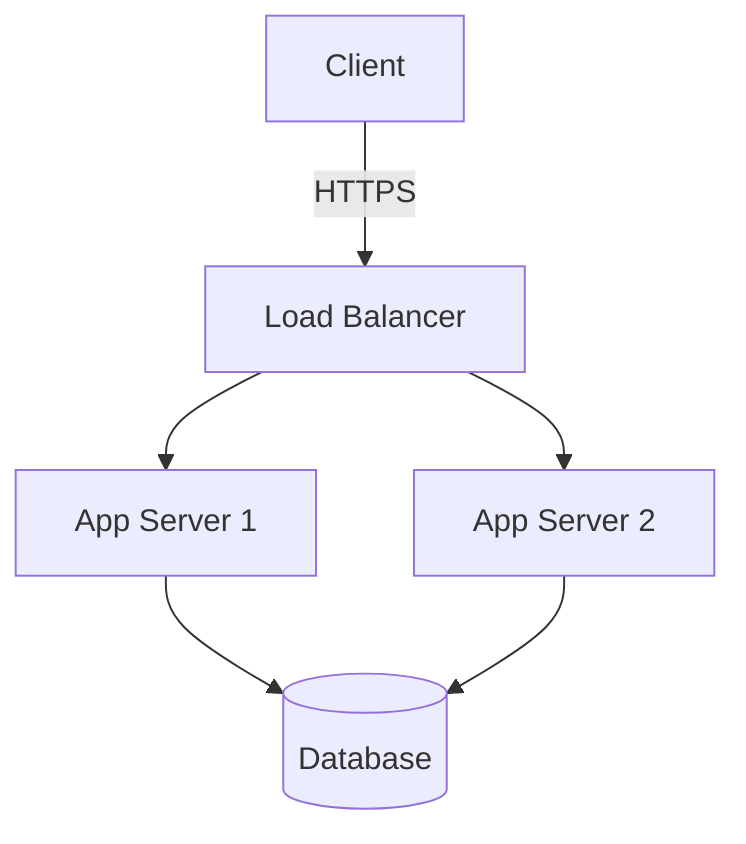
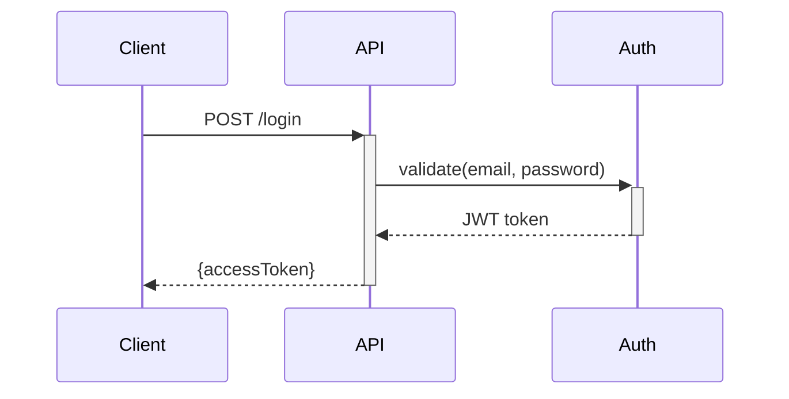
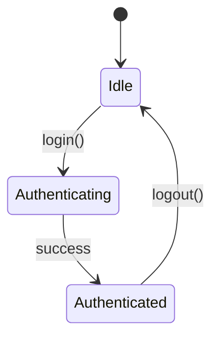

# Write-Spec

This skill covers:
- [When to Create](#when-to-create) - Decision criteria
- [Frontmatter](#frontmatter) - Required metadata fields
- [Body Structure](#body-structure) - Template and organization
- [Scope Definition](#scope-definition) - File path patterns
- [Style Guide](#style-guide) - What to include/exclude
- [Diagramming](#diagramming) - Mermaid examples
- [Relationship to Changes](#relationship-to-changes) - Keeping specs current
- [Deprecation](#deprecation) - Archiving obsolete specs
- [Multi-File Specs](#multi-file-specs) - Complex subsystems
- [Examples](#examples) - Good vs bad specs

---

## When to Create

Create a spec-doc when:
- A subsystem has design decisions that aren't obvious from code alone
- Multiple changes will touch the same area and need shared context
- The architecture involves non-trivial component interactions
- API contracts need to be documented for external consumers or cross-team use
- A convention or standard applies across multiple files/modules

**Don't create** when:
- Code comments and type signatures adequately capture the design
- The topic is a single-file implementation detail
- The information would duplicate framework/library documentation

**Rule of thumb**: If a new developer would need 10+ minutes to understand the design intent from code alone, it deserves a spec-doc.

---

## Frontmatter

Required YAML header for all specs:

```yaml
---
name: Authentication System
description: JWT-based auth with refresh tokens and rate limiting
updated: 2026-01-27
scope:
  - /src/auth/**
  - /src/middleware/auth.ts
  - /config/security.ts
deprecated: false
replacement: ""
---
```

| Field | Required | Description |
|-------|----------|-------------|
| `name` | Yes | Spec title |
| `description` | Yes | One-sentence summary |
| `updated` | Yes | Last modification (YYYY-MM-DD) |
| `scope` | Yes | File paths this spec covers (glob patterns) |
| `deprecated` | No | `true` if spec is obsolete |
| `replacement` | No | Path to new spec (if deprecated) |

---

## Body Structure

The structure should match the **type of spec**. Below are recommended skeletons — adapt sections to fit the subject.

### Architecture Spec

```markdown
# <System Name>

## Overview
**Purpose**: Why this system exists
**Scope**: What's covered / what's excluded

## Architecture
<!-- Mermaid diagram -->

## Components
| Component | Responsibility | Location |
|-----------|----------------|----------|

## Key Decisions
**<Decision>**: <chosen approach> | Trade-off: <what was sacrificed>

## Configuration
## Testing Requirements
```

### API Contract Spec

```markdown
# <API Name>

## Overview
**Base URL**: `/api/v2/...`
**Auth**: Bearer token required

## Endpoints
### POST /resource
**Request**: ...
**Response**: ...
**Errors**: ...

## Data Models
## Rate Limits
## Versioning Policy
```

### Convention / Standard Spec

```markdown
# <Convention Name>

## Overview
**Purpose**: Why this convention exists
**Applies to**: <file patterns or modules>

## Rules
## Examples
## Exceptions
```

The key principle: **structure serves content**. Don't force an architecture template on an API contract.

---

## Scope Definition

Agents use `scope` to find relevant files. Use glob patterns:

```yaml
scope:
  - /src/auth/**           # All files in directory
  - /src/middleware/auth.ts # Specific file
  - /config/security.ts     # Config
  - /tests/auth/**          # Tests
```

**Include**: Primary implementation, tests, config
**Omit**: Generic utilities unless domain-specific

---

## Style Guide

### ✅ MUST Include

1. **File paths**: Every component needs a location
2. **Concrete values**: "15min expiry" not "short expiry"
3. **Decision rationale**: Why this design, what trade-offs
4. **Diagrams**: Architecture and flows (Mermaid/PlantUML)

### ❌ MUST NOT Include

1. **Change logs**: History lives in git, not specs
2. **Multiple unrelated topics**: One doc = one topic
3. **Marketing language**: No "revolutionary", "cutting-edge"
4. **Vague statements**: Quantify everything
5. **Common knowledge**: Don't explain REST, HTTP, basic concepts

### Language

- **Imperative mood**: "Validate tokens" not "The system should validate"
- **Direct**: Avoid "It's worth noting...", "As mentioned earlier..."
- **Precise**: "Use Redis (5min TTL)" not "Consider using Redis"

### File Links

1. **Simple Relative Paths**: For same-level, sub-directories, or up to 2 levels of parent.
   - `[Link](./other-spec.md)`
   - `[Link](../../base.md)` (Max two `../`)
2. **Workspace-Relative Paths**: For different branches or >2 parent levels. Start with `/`.
   - `[Link](/src/core.py)`
3. Use forward slashes `/` for cross-platform compatibility.

---

## Diagramming

Use Mermaid or PlantUML.

**Architecture**:


**Sequence**:


**State machine**:


Avoid ASCII art.

---

## Relationship to Changes

Spec-docs and changes interact in two ways:

### Change Creates a Spec-Doc
When a change introduces a new subsystem or architecture, create the corresponding spec-doc as part of the change's tasks. Link via the reference field:
```yaml
# In change spec.md frontmatter:
reference:
  - source: "spec-docs/auth-system.md"
    type: "doc"
```

### Change Modifies an Existing Spec-Doc
When a change alters behavior documented in a spec-doc:
1. Add a task in tasks.md: "Update spec-doc `spec-docs/<name>.md`"
2. Update the spec-doc's `updated` field and affected sections
3. Verify `scope` still matches actual files

**Principle**: Spec-docs should never be silently outdated by a change. If code changes, the spec changes in the same change.

---

## Deprecation

When design becomes obsolete:

1. Mark in frontmatter: `deprecated: true`, `replacement: /path/to/new.md`
2. Move to `spec-docs/archive/`
3. Add notice: `> ⚠️ **DEPRECATED**: Replaced by [New Spec](../new.md)`
4. Strip details, keep only: what it was, why deprecated, link to replacement

---

## Multi-File Specs

For complex subsystems needing multiple documents:

```
spec-docs/payment-system/
├── index.md          # Entry point — overview + navigation
├── gateway.md        # Stripe integration
├── webhooks.md       # Event handling
└── reconciliation.md # Ledger matching
```

### index.md

```yaml
---
name: Payment System
description: Complete payment processing subsystem
updated: 2026-01-27
files:
  - gateway.md
  - webhooks.md
  - reconciliation.md
scope:
  - /src/payment/**
---
```

### Organization Rules

- **index.md is the entry point**: Contains overview, component map, and links to sub-files
- **Each sub-file is self-contained**: Has its own frontmatter with narrowed `scope`
- **Cross-references use relative paths**: `[See Gateway](./gateway.md#error-handling)`
- **Shared concepts go in index.md**: Avoid duplicating definitions across sub-files

---

## Examples

### ✅ Good Spec

```markdown
---
name: Rate Limiting
description: Token bucket algorithm with Redis backend
updated: 2026-01-27
scope:
  - /src/middleware/rate-limit.ts
  - /src/cache/redis.ts
---

# Rate Limiting

## Overview
**Purpose**: Prevent API abuse
**Algorithm**: Token bucket (allows burst)

## Configuration

| Endpoint | Limit | Window | Burst |
|----------|-------|--------|-------|
| POST /auth/login | 5 | 15min | 10 |
| GET /api/* | 100 | 1min | 150 |

## Implementation

**Storage**: Redis sorted set (`rl:{ip}:{endpoint}`)

## Error Response

HTTP 429, `Retry-After` header:
`{ "error": "Rate limit exceeded", "retryAfter": 847 }`
```

### ❌ Bad Spec

```markdown
# Our Amazing API

## Introduction
Welcome to our revolutionary API! We've built this using cutting-edge
best practices to ensure maximum scalability and performance.

## Future Plans
We're planning to add ML and blockchain in future versions.
```

**Problems**: Marketing fluff, no concrete info, no file paths, includes unbuilt features.

---

## Maintenance Checklist

- [ ] `updated` field current
- [ ] `scope` matches actual files
- [ ] Diagrams reflect current architecture
- [ ] Code examples compile
- [ ] Links to other specs valid
