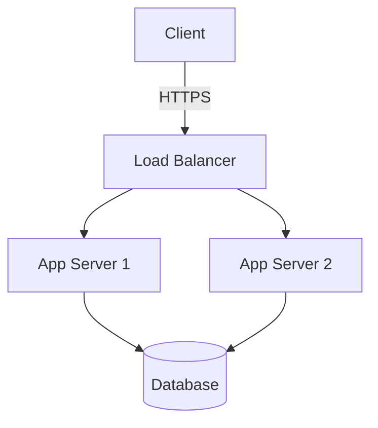
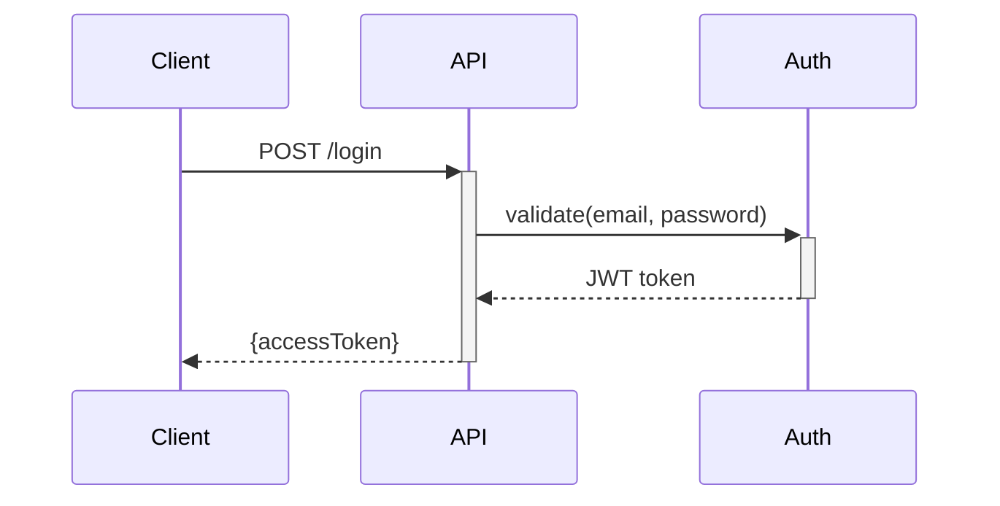

# Write-Spec

This skill covers:
- [When to Create](#when-to-create) - Decision criteria
- [Frontmatter](#frontmatter) - Required metadata fields
- [Body Structure](#body-structure) - Template and organization
- [Scope Definition](#scope-definition) - File path patterns
- [Style Guide](#style-guide) - What to include/exclude
- [Diagramming](#diagramming) - Mermaid examples
- [Relationship to Changes](#relationship-to-changes) - Keeping specs current
- [Deprecation](#deprecation) - Archiving obsolete specs
- [Multi-File Specs](#multi-file-specs) - Complex subsystems
- [Examples](#examples) - Good vs bad specs

---

## When to Create

Create a spec-doc when:
- A subsystem has design decisions that aren't obvious from code alone
- Multiple changes will touch the same area and need shared context
- The architecture involves non-trivial component interactions
- API contracts need to be documented for external consumers
- A convention or standard applies across multiple files/modules

**Don't create** when:
- Code comments and type signatures adequately capture the design
- The topic is a single-file implementation detail
- The information would duplicate framework/library documentation

**Rule of thumb**: If a new developer would need 10+ minutes to understand the design intent from code alone, it deserves a spec-doc.

---

## Frontmatter

```yaml
---
name: Authentication System
description: JWT-based auth with refresh tokens and rate limiting
updated: 2026-01-27
scope:
  - /src/auth/**
  - /src/middleware/auth.ts
  - /config/security.ts
deprecated: false
replacement: ""
---
```

| Field | Required | Description |
|-------|----------|-------------|
| `name` | Yes | Spec title |
| `description` | Yes | One-sentence summary |
| `updated` | Yes | Last modification (YYYY-MM-DD) |
| `scope` | Yes | File paths this spec covers (glob patterns) |
| `deprecated` | No | `true` if spec is obsolete |
| `replacement` | No | Path to new spec (if deprecated) |

---

## Body Structure

The structure should match the **type of spec**:

### Architecture Spec
```markdown
# <System Name>
## Overview
## Architecture (with Mermaid diagram)
## Components
## Key Decisions
## Configuration
## Testing Requirements
```

### API Contract Spec
```markdown
# <API Name>
## Overview (Base URL, Auth)
## Endpoints
## Data Models
## Rate Limits
## Versioning Policy
```

### Convention / Standard Spec
```markdown
# <Convention Name>
## Overview (Purpose, Applies to)
## Rules
## Examples
## Exceptions
```

Key principle: **structure serves content**. Don't force an architecture template on an API contract.

---

## Scope Definition

Agents use `scope` to find relevant files. Use glob patterns:

```yaml
scope:
  - /src/auth/**           # All files in directory
  - /src/middleware/auth.ts # Specific file
  - /tests/auth/**         # Tests
```

**Include**: Primary implementation, tests, config.
**Omit**: Generic utilities unless domain-specific.

---

## Style Guide

### MUST Include
1. File paths for every component
2. Concrete values ("15min expiry" not "short expiry")
3. Decision rationale (why this design, what trade-offs)
4. Diagrams for architecture and flows

### MUST NOT Include
1. Change logs (history lives in git)
2. Multiple unrelated topics
3. Marketing language
4. Vague statements — quantify everything
5. Common knowledge (don't explain REST, HTTP)

### Language
- **Imperative mood**: "Validate tokens" not "The system should validate"
- **Direct**: Avoid "It's worth noting...", "As mentioned earlier..."
- **Precise**: "Use Redis (5min TTL)" not "Consider using Redis"

### File Links

1. **Simple Relative Paths**: For same-level, sub-directories, or up to 2 levels of parent.
   - `[Link](./other-spec.md)`
   - `[Link](../../base.md)` (Max two `../`)
2. **Workspace-Relative Paths**: For different branches or >2 parent levels. Start with `/`.
   - `[Link](/src/core.py)`
3. Use forward slashes `/` for cross-platform compatibility.

---

## Diagramming

Use Mermaid. Architecture example:


Sequence example:


Avoid ASCII art.

---

## Relationship to Changes

### Change Creates a Spec-Doc
Link via reference field:
```yaml
reference:
  - source: "spec-docs/auth-system.md"
    type: "doc"
```

### Change Modifies an Existing Spec-Doc
1. Add task in tasks.md: "Update spec-doc `spec-docs/<n>.md`"
2. Update the spec-doc's `updated` field and affected sections
3. Verify `scope` still matches actual files

**Principle**: Spec-docs should never be silently outdated by a change.

---

## Deprecation

1. Mark: `deprecated: true`, `replacement: /path/to/new.md`
2. Move to `spec-docs/archive/`
3. Add notice: `> ⚠️ **DEPRECATED**: Replaced by [New Spec](../new.md)`
4. Strip details, keep only: what it was, why deprecated, link to replacement

---

## Multi-File Specs

```
spec-docs/payment-system/
├── index.md          # Entry point
├── gateway.md
├── webhooks.md
└── reconciliation.md
```

Rules:
- index.md is the entry point with overview + navigation
- Each sub-file has its own frontmatter with narrowed scope
- Cross-references use relative paths
- Shared concepts go in index.md

---

## Examples

### Good Spec
Concrete, quantified, has file paths, diagrams, and configuration tables.

### Bad Spec
"Welcome to our revolutionary API!" — marketing fluff, no concrete info, no file paths, includes unbuilt features.

---

## Maintenance Checklist
- [ ] `updated` field current
- [ ] `scope` matches actual files
- [ ] Diagrams reflect current architecture
- [ ] Code examples compile
- [ ] Links to other specs valid
